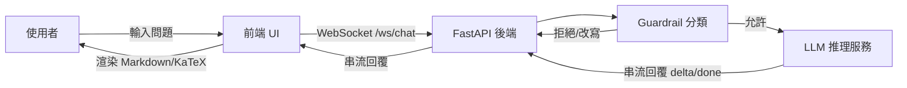

# CS_Agent

CS_Agent 是一個**即時客服對話系統**，採用 **FastAPI（後端）+ React/Vite（前端）** 的架構，並可串接本地或雲端的 LLM 推理服務。系統重點在於 **WebSocket 串流回覆、Guardrail 分類、對話生命週期管理**，以及**安全的前端 Markdown/數學式渲染**。

---

## 技術概覽（詳細）

### 後端（FastAPI）
- **FastAPI + Uvicorn**：提供 HTTP/WS 服務與高併發處理能力。
- **WebSocket**：以 `/ws/chat` 提供即時串流回覆（`delta`/`done`）。
- **Pydantic Settings**：集中管理 `.env` 與部署參數（如 LLM URL、CORS）。
- **httpx**：呼叫外部 LLM 推理 API，支援串流回傳。
- **cachetools**：輔助 session/狀態管理與快取。
- **python-multipart**：支援表單資料處理（若後續擴充上傳功能）。

### 前端（React + Vite）
- **React 19**：負責 UI、對話內容與狀態更新。
- **Vite（rolldown-vite）**：快速開發與建置，支援現代化打包流程。
- **Markdown 渲染**：`react-markdown` 搭配 `remark-gfm/remark-math`。
- **KaTeX**：數學公式排版（`rehype-katex`）。
- **語法高亮**：`rehype-highlight` + `highlight.js`。
- **內容清理**：`DOMPurify` + `rehype-sanitize` 雙層防護。

### LLM 服務（可選）
- 支援本地 `llama.cpp` 或外部推理服務。
- 透過 `LLAMA_API_URL` 進行串流推理呼叫。

---

## 主要功能

- **WebSocket 串流回覆**：後端 `delta`/`done`，前端緩衝與 flush 渲染。
- **Guardrail 分類**：一般、辱罵、提示攻擊、垃圾訊息等類型判斷。
- **對話歷史管理**：支援清除、摘要、閒置警告與結束流程。
- **前端安全渲染**：支援 Markdown、KaTeX、程式碼區塊，同時具備清理機制。

---

## 系統流程圖



---

## 專案結構

```text
CS_Agent/
├── backend/                 # FastAPI + WebSocket + Guardrail + LLM 串流
│   ├── app/
│   │   ├── main.py
│   │   ├── config.py
│   │   ├── routers/ws.py
│   │   └── services/
│   ├── classifcation/       # 分類模型相關（另見其 README）
│   └── README.md
├── Front/                   # React + Vite 聊天前端
│   └── README.md
├── LLM_gen/                 # 本地 LLM 推理服務（llama.cpp）
│   └── README.md
└── README.md
```

---

## 快速開始

### 1) 啟動後端

```bash
cd backend
python3 -m pip install -r requirements.txt
uvicorn app.main:app --reload --host 0.0.0.0 --port 8000
```

### 2) 啟動前端

```bash
cd Front
npm ci
npm run dev
```

前端預設連線到：

```text
ws://<目前網頁主機>:8000/ws/chat
```

### 3) （選用）啟動 LLM 服務

若需要本地 llama.cpp 服務，可參考 `LLM_gen/README.md`。

---

## 環境需求

- **Python 3.10+**（後端）
- **Node.js 18+（建議 20+）**（前端）
- **npm 9+**
- 可連線的 LLM 推理服務（依 `backend/app/config.py` 設定）

---

## 設定與部署提醒

- 請在正式環境配置 `.env`，避免直接使用預設 URL/timeout。
- 後端設定集中於 `backend/app/config.py`，包含：
  - `LLAMA_API_URL` / `LLAMA_API_KEY`
  - `CORS_ORIGINS`
  - `MAX_MESSAGE_SIZE` / `HISTORY_MAX_LENGTH`
- 前端可用 `VITE_WS_URL` 或 `VITE_WS_PORT` 覆蓋 WebSocket 連線。

---

## 文件索引

- 後端說明：`backend/README.md`
- 前端說明：`Front/README.md`
- LLM 服務：`LLM_gen/README.md`
- 本次程式審查：`CODE_REVIEW_2026-04-28.md`

---

## 注意事項

- `backend/classifcation/` 為**獨立分類資料與模型**目錄，請依該目錄內文件與流程管理。
- 若需擴充協定或事件型別，請同步更新前後端的事件處理邏輯。
